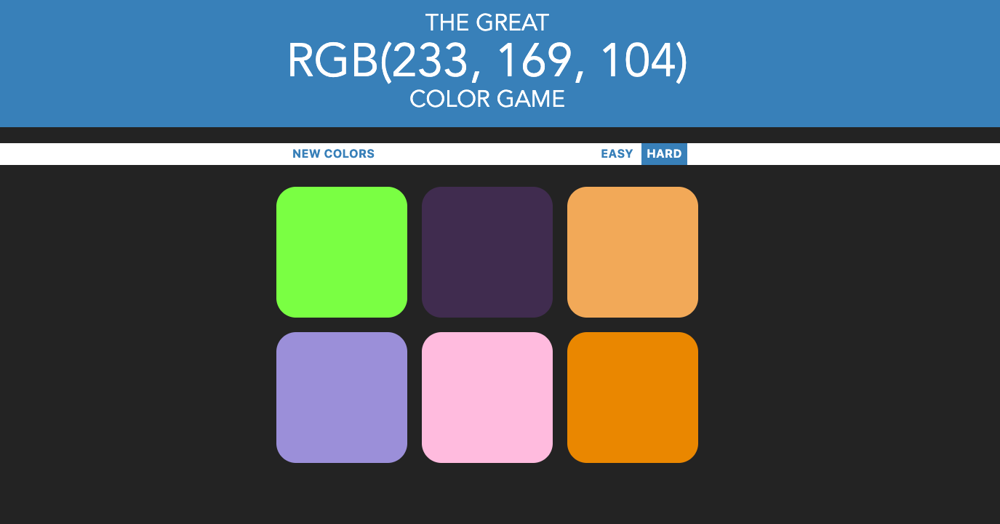

# RGB-Guessing-Game

A simple game developed with Vanilla Javascript, CSS and HTML. See how well you can match a color to RGB value.

## Installation and playing instructions

First `git clone` this project to a local repository. Then open the rgbGame.html in your browser.

You will automatically get a random RGB value at the top row of the page. Below that there are colored squares one of which represents the given RGB value. CLick and try to guess the right color!

Select either "easy" to play with three color options or "hard" to guess amongst six colors.
